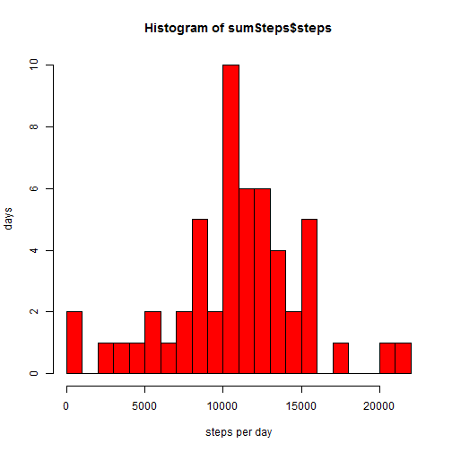
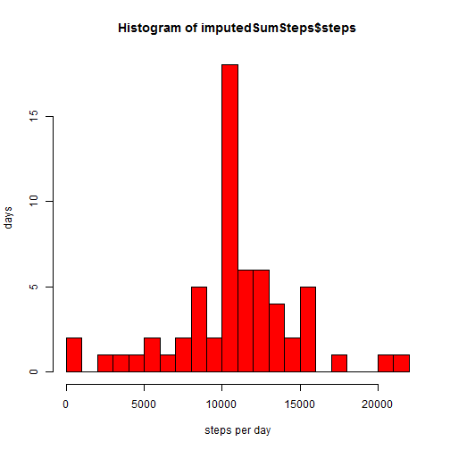
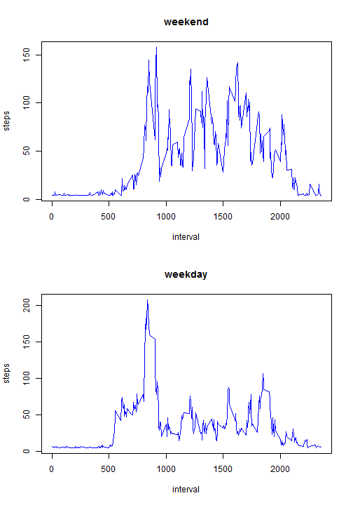

## Loading and preprocessing the data

Unzip the file and load it into a dataframe

```r
unzip("./activity.zip", overwrite = T)
activityDF<-read.csv("activity.csv",header=TRUE, na.strings = "NA")
activityDF$date<-as.Date(activityDF$date)
```

## What is mean total number of steps taken per day?

Reduce the dataframe to complete cases and sum the steps by date

```r
completeDF<-activityDF[complete.cases(activityDF),]
sumSteps<-aggregate(steps ~ date, completeDF, sum)
```

Create a hist of the aggregated data

```r
hist(sumSteps$steps,  ylab="days", col="red", xlab="steps per day", breaks=20)
```

 

A summary table of the data with mean and median

```r
summary(sumSteps$steps)
```

```
##    Min. 1st Qu.  Median    Mean 3rd Qu.    Max. 
##      41    8841   10760   10770   13290   21190
```


## What is the average daily activity pattern?

Take the mean of the number of steps per interval and plot

```r
averageDailyStepsDF <- aggregate(steps ~ interval, completeDF,  mean)
plot(steps ~ interval, averageDailyStepsDF, type = "l")
```

 

Determine which 5-minute interval contains the max number of average steps

```r
averageDailyStepsDF[averageDailyStepsDF$steps == max(averageDailyStepsDF$steps),]
```

```
##     interval    steps
## 104      835 206.1698
```

## Imputing missing values

Determine the rows with missing data

```r
missingValues<-sum(!complete.cases(activityDF))
missingValues
```

```
## [1] 2304
```

Calculate the mean of all the intervals and use that as the imputed value and sum the imputed data

```r
meanStepsPerPeriod<-mean(completeDF$steps)
imputedDF<-activityDF
imputedDF$steps[is.na(activityDF$steps)] <- meanStepsPerPeriod
imputedSumSteps<-aggregate(steps ~ date, imputedDF, sum)
```

Create a hist of the aggregated imputed data

```r
hist(imputedSumSteps$steps,  ylab="days", col="red", xlab="steps per day", breaks=20)
```

 

A summary table of the imputed data

```r
summary(imputedSumSteps$steps)
```

```
##    Min. 1st Qu.  Median    Mean 3rd Qu.    Max. 
##      41    9819   10770   10770   12810   21190
```


Although imputing data in the way I did pushes the maximum up significantly, it doesn't shift the mean and median significantly.


## Are there differences in activity patterns between weekdays and weekends?

Add a colum indicating the day of week, and then a colum indicating if it is a weekday

```r
imputedDF$day<-weekdays(imputedDF$date)
imputedDF$isWeekday<-(imputedDF$day %in% c("Monday","Tuesday","Wednesday","Thursday","Friday"))
weekendDF<-imputedDF[imputedDF$isWeekday == FALSE,]
weekdayDF<-imputedDF[imputedDF$isWeekday == TRUE,]
```


Take the averages again

```r
averageDailyStepsWeekendDF <- aggregate(steps ~ interval, weekendDF,  mean)
averageDailyStepsWeekdayDF <- aggregate(steps ~ interval, weekdayDF,  mean)
```

Create the plot

```r
par(mfcol = c(2,1))

with(averageDailyStepsWeekendDF, {
        plot(x=interval, y=steps, xlab="interval", 
             ylab="steps", type="n")
        lines(x=interval, y=steps, col="blue",main="weekday")
        title("weekend")
        })


with(averageDailyStepsWeekdayDF, {
        plot(x=interval, y=steps, xlab="interval", 
             ylab="steps", type="n")
        lines(x=interval, y=steps, col="blue",main="weekend")
        title("weekday")
        })
```

 

